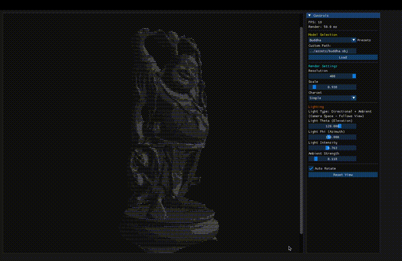

# ASCII 3D Renderer

A geeky real-time ASCII art renderer that transforms 3D meshes into beautiful character-based visualizations.



## Background

This project was created as a creative final assignment for **CSC317 Computer Graphics** at the University of Toronto. Inspired by the retro aesthetic of terminal-based graphics and the elegance of ray tracing, I wanted to create something that bridges classical rendering techniques with an unconventional output medium.

The idea emerged from a simple question: *"What if we could experience ray-traced 3D graphics in pure ASCII?"* This project explores that intersection, combining the mathematical precision of computer graphics with the nostalgic charm of text-based art.

## Project Overview

This renderer takes standard 3D mesh files (OBJ format) and renders them in real-time as ASCII art using ray tracing techniques. The output is displayed in a live GUI where users can interactively adjust rendering parameters, lighting, and camera settings.

**Key Features:**
- Real-time ray-traced ASCII rendering
- Interactive camera controls with automatic rotation
- Adjustable lighting system (directional + ambient)
- Multiple character sets (Simple/Detailed)
- BVH acceleration for efficient rendering
- Live parameter tuning via ImGui interface

## Technical Implementation

### 1. **Foundation: Building on Course Material**

The project leverages fundamental components from previous CSC317 assignments:

- **Mesh Loading & Processing** (`read_obj.cpp`, `per_vertex_normals.cpp`)
  - Loads OBJ files and computes smooth vertex normals
  - Handles triangle mesh data structures

- **Ray Tracing Core** (`ray_intersect_triangle.cpp`, `ray_intersect_box.cpp`)
  - Implements Möller-Trumbore ray-triangle intersection
  - Axis-aligned bounding box intersection tests

- **Spatial Acceleration** (`AABBTree.cpp`)
  - Constructs a Bounding Volume Hierarchy (BVH) for fast ray queries
  - Recursive tree traversal with early termination

### 2. **Novel Components: The ASCII Renderer**

#### **ASCIIRenderer Class** (`ASCIIRenderer.h/cpp`)

The heart of the project - converts 3D geometry to ASCII characters:

```
For each character position (i, j):
  1. Generate viewing ray through pixel
  2. Trace ray through BVH to find nearest intersection
  3. Compute lighting at hit point (Lambertian + ambient)
  4. Map brightness [0,1] → character from charset
```

**Character Mapping:**
- Simple: `" .:-=+*#%@"` (10 chars)
- Detailed: `" .'^\",;Il!i><~+_-?...MW&8%B@$"` (70+ chars)

Brightness is calculated using basic Phong-style shading:
```cpp
brightness = ambient_strength + max(0, normal · (-light_direction)) * intensity
```

#### **Camera System** (`CameraController.h`)

Implements a spherical camera controller:
- **Position**: Fixed radius, controlled by spherical coordinates (θ, φ)
- **Orientation**: Always looks at model center
- **Scale**: Adjusts field-of-view, not distance (proper zoom)
- **Auto-rotation**: Smooth phi interpolation for automatic turntable effect

#### **Lighting Model**

**Camera-Space Directional Light:**
The lighting system uses a directional light defined in camera space, meaning the light rotates with the camera. This ensures consistent illumination regardless of viewing angle.

```cpp
light_direction = sin(θ) * cos(φ) * camera.right +
                  cos(θ) * camera.up +
                  sin(θ) * sin(φ) * camera.forward
```

**Why camera space?** For ASCII art, we want the model to always be well-lit from the viewer's perspective, similar to 3D modeling software viewport lighting. This prevents dark, unreadable views when the camera rotates behind the object.

### 3. **GUI Integration** (`main.cpp`)

Built with **ImGui + GLFW + OpenGL**, the interface provides:
- Real-time ASCII viewport with automatic font scaling
- Model selection (presets + custom path input)
- Rendering controls (resolution, scale, charset)
- Lighting controls (theta, phi, intensity, ambient)
- Camera controls (auto-rotate toggle, reset button)
- Performance metrics (FPS, render time)

### 4. **Performance Optimizations**

- **BVH Acceleration**: Reduces ray-mesh intersections from O(n) to O(log n)
- **Early Ray Termination**: Stops at first intersection (no need for closest hit in many cases)
- **String Pre-allocation**: Reserves output buffer to minimize allocations
- **Single-pass Rendering**: No multi-sampling or anti-aliasing (intentional for ASCII aesthetic)

**Typical Performance:**
- ~60 FPS @ 120×60 resolution (Dragon mesh, 871k triangles)
- Scales linearly with resolution (40-400 characters wide)

## Code Structure

```
include/
├── AABBTree.h              # BVH acceleration structure
├── ASCIIRenderer.h         # Main rendering engine (NEW)
├── Camera.h                # Camera parameters
├── CameraController.h      # Interactive camera system (NEW)
├── Light.h                 # Light structures (NEW)
├── MeshTriangle.h          # Triangle primitive
├── Object.h                # Base object interface
├── Ray.h                   # Ray structure
├── Scene.h                 # Scene management (NEW)
└── [geometry utilities]    # Triangle normals, AABB, etc.

src/
├── AABBTree.cpp            # BVH construction & traversal
├── ASCIIRenderer.cpp       # Rendering implementation (NEW)
├── [intersection tests]    # Ray-geometry math
└── [mesh processing]       # OBJ loading, normal computation

main.cpp                    # GUI application (NEW)
```

## Building & Running

**Requirements:**
- CMake 3.10+
- C++17 compiler
- Eigen3 (linear algebra)
- GLFW3 (windowing)
- OpenGL 3.2+ (for ImGui)
- ImGui (included in `external/`)

**Build:**
```bash
mkdir build && cd build
cmake .. -DUSE_IMGUI=ON
make
./MyGeekyRenderer [optional_model.obj]
```

**Controls:**
- Load models via dropdown or custom path
- Adjust resolution slider for detail/performance tradeoff
- Toggle "Auto Rotate" for animated turntable
- Tweak lighting angles for different effects
- Switch between Simple/Detailed charsets


